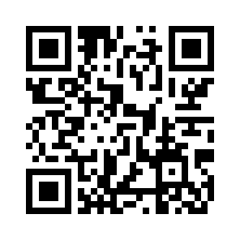
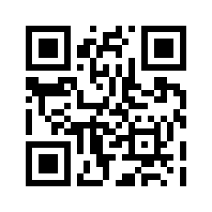

# Event Quickstart

Diese Seite ist für den schnellen Start am Event gedacht. Sie enthält nur die wichtigsten Schritte für Helferinnen und Helfer.

## 1. WLAN verbinden

Falls das Gerät noch nicht im Event-Netz ist, zuerst den WLAN-QR-Code scannen:

{ width=200px }

## 2. Kasse öffnen

Danach den QR-Code für die Kasse scannen:

{ width=200px }

Direktlink zur Kasse:

- `http://192.168.50.1:8000/cashier`

## 3. Falls die Kasse nicht lädt

In dieser Reihenfolge prüfen:

1. Ist das Gerät wirklich mit dem Event-WLAN verbunden?
2. Lädt `http://192.168.50.1:8000/cashier` im Browser?
3. Ist der Raspberry Pi eingeschaltet?
4. Wurde lange genug gewartet, bis das System vollständig gestartet ist?
5. Falls weiterhin nichts funktioniert, verantwortliche Person holen.

